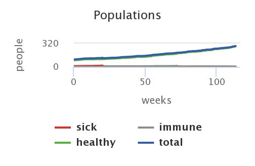
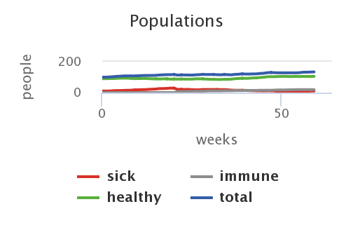

<h1>Імітаційне моделювання комп'ютерних систем</h1>

<h2>Лабораторна робота №1. Опис імітаційних моделей</h2>

<h3>СПм-21-2, Барсуков Антон Ігорович </h3>

<h2>Модель:
<a href="https://www.netlogoweb.org/launch#https://www.netlogoweb.org/assets/modelslib/Sample%20Models/Biology/Virus.nlogo">
Virus
</a>
</h2>

<h3>Опис моделі:</h3>

Ця модель імітує передачу та збереження вірусу в людській популяції. Модель ініціалізована 150 людьми, з яких 10 заражені. Люди випадково пересуваються світом в одному з трьох станів: здорові, але чутливі до інфекції (зелений), хворі та інфекційні (червоний) і здорові та імунітет (сірий). Люди можуть померти від інфекції або старості. Коли популяція падає нижче «пропускної здатності» середовища (встановленої на рівні 300 у цій моделі), здорові люди можуть народжувати здорове (але сприйнятливе) потомство.

<h4>Керуючі параметри:</h4>
<ul>
<li>number-people ( кількість людей початкової популяції ).</li>
<li>infectiousness (Як легко поширюється вірус).</li>
<li>chance-recover (шанс видужати)</li>
<li>duration weeks (Як довго людина інфікована, перш ніж вона або одужає, або помре).</li>
<li>turtle-shape (Вибирає якою формою буде людина ).</li>
</ul>

h4>Внутрішні параметри:</h4>
<ul>
<li>infected (відсоток інфикованих ).</li>
<li>immune (відсоток з імунітетом).</li>
<li>years (тривалість життя).</li>
<ul>

<h4>Критерії ефективності системи:</h4>
<ul>
<li>відсоток інфикованих людей .</li>
<li>відсоток людей  з імунітетом.</li>
<li>тривалість життя загалом .</li>
</ul>

<h3>Обчислювальні експерименти</h3>

<h4>1. Вплив зміни відсотку інфікованих  на тривалість заразності </h4>

Залежність тривалості заразності від зміни відсотку інфікованих при незмінній кількості людей.

<table>
<thead>
<tr>
<th>кількість людей </th>
<th>відсоток інфікованих</th>
<th>тривалість заразності</th>
</tr>
</thead>
<tbody>
<tr>
<td>100</td>
<td>15</td>
<td>0,46</td>
</tr>
<tr>
<td>100</td>
<td>25</td>
<td>0,63</td>
</tr>
<td>100</td>
<td>30</td>
<td>0.67</td>
</tr>
<tr>
<td>100</td>
<td>35</td>
<td>0.75</td>
</tr>
<tr>
<td>100</td>
<td>40</td>
<td>0,96</td>
</tr>
</tbody>
</table>

Чим більший відсоток інфікованих, тим більша тривалість життя вірусу, що підтвердженно результатами моделювання.

<h4>2. Вплив тривалості хвороби на тотальну кількість людей через один рік </h4>

Залежність загальної кількості людей відносно тривалості хвороби через один рік
Зміна тривалості хвороби від 5 до 20 тижнів з кроком 5.

<table>
<thead>
<tr>
<th>Кількість людей через рік</th>
<th>тривалість інфікування</th>
</tr>
</thead>
<tbody>
<tr>
<td>162</td>
<td>5</td>
</tr>
<tr>
<td>158</td>
<td>10</td>
</tr>
<tr>
<td>119</td>
<td>15</td>
</tr>
<tr>
<td>128</td>
<td>20</td>
</tr>
</tbody>
</table>

Чим довше тривалість інфікування, тим менша популяція людей.

<h4>3. Вплив шансу одужання на відсоток людей з імунітетом</h4>

Залежність кількості людей з імунітетом від шансу одужання при незмінному відсотку інфікованих.
Зміна шансу одужання від 20% до 80% з кроком в 15.

<table>
<thead>
<tr>
<th>Шанс одужання</th>
<th>Кількість людей з імунітетом</th>
</tr>
</thead>
<tbody>
<tr>
<td>20</td>
<td>3</td>
</tr>
<tr>
<td>35</td>
<td>8</td>
</tr>
<tr>
<td>50</td>
<td>12</td>
</tr>
<tr>
<td>65</td>
<td>9</td>
</tr>
<tr>
<td>80</td>
<td>22</td>
</tr>
</tbody>
</table>

Чим більший шанс на одужання, тим більша кількість людей з імунітетом.

